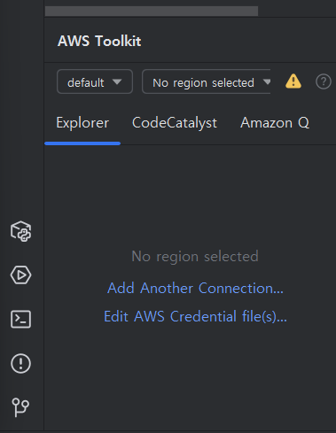

# AWS SDK

## 1. AWS SDK 소개
AWS SDK(Amazon Web Services Software Development Kit)는 Amazon Web Services(AWS)에서 제공하는 클라우드 서비스를 프로그래밍적으로 쉽게 사용할 수 있도록 지원하는 개발 도구입니다. AWS SDK는 다양한 프로그래밍 언어(Java, Python, C#, JavaScript 등)로 제공되며, 이를 통해 개발자들은 AWS의 서비스를 애플리케이션에 통합하거나 자동화할 수 있습니다.

### 1.1 AWS SDK의 주요 기능
1.	서비스 API 호출:
	- SDK는 AWS의 다양한 서비스(S3, EC2, DynamoDB, Lambda 등)를 호출할 수 있도록 API를 제공합니다. 이를 통해 직접 AWS 웹 콘솔을 사용하지 않고도 애플리케이션에서 클라우드 리소스를 관리할 수 있습니다.
2.	인증 및 권한 관리:
	- AWS SDK는 AWS 계정의 자격 증명(액세스 키, 시크릿 키 등)을 쉽게 관리할 수 있는 기능을 제공합니다. 이를 통해 프로그래밍에서 안전하게 AWS 서비스에 접근할 수 있습니다.
3.	다양한 언어 지원:
	- SDK는 Java, Kotlin, Python(Boto3), JavaScript(Node.js), .NET, Ruby, Go, PHP 등 다양한 프로그래밍 언어를 지원하여 개발 환경에 맞는 언어로 AWS 리소스를 제어할 수 있습니다.
4.	높은 수준의 추상화:
	- AWS SDK는 AWS 서비스 API의 복잡성을 추상화하여 고수준의 인터페이스를 제공하며, 이를 통해 AWS 리소스를 더 간편하게 관리할 수 있습니다. 복잡한 HTTP 요청 및 응답 처리를 SDK가 자동으로 처리해 줍니다.
5.	로컬 및 원격 리소스 관리:
	- AWS SDK는 로컬 환경에서 AWS 자격 증명과 리전을 관리하고, 프로그래밍을 통해 클라우드 리소스의 생성, 수정, 삭제를 수행할 수 있습니다.
6.	AWS 서비스와의 통합:
	- AWS SDK는 AWS 클라우드의 거의 모든 서비스와 통합됩니다. S3, EC2, Lambda, DynamoDB, CloudFormation 등 AWS의 핵심 서비스들과 쉽게 연동하여 애플리케이션을 클라우드 인프라에 배포하고 관리할 수 있습니다.

## 2. Java용 AWS SDK
AWS SDK for Java는 Java 프로그래밍 언어로 Amazon Web Services(AWS)의 다양한 클라우드 서비스를 쉽게 사용할 수 있도록 해주는 라이브러리 모음입니다. AWS SDK for Java는 AWS의 인프라와 서비스에 대한 접근을 자동화하고, 복잡한 API 호출을 간편하게 처리할 수 있도록 도와줍니다.

### 2.1 주요 특징
1.	포괄적인 AWS 서비스 지원:
	- Java SDK는 Amazon S3(파일 저장), Amazon EC2(가상 서버), Amazon RDS(관계형 데이터베이스), Amazon DynamoDB(NoSQL 데이터베이스), AWS Lambda(서버리스 함수 실행) 등 다양한 AWS 서비스를 지원합니다.
    - 이를 통해 Java 애플리케이션에서 AWS 클라우드 리소스를 손쉽게 관리하고 통합할 수 있습니다.
2.	비동기 및 동기 API 지원:
	- AWS SDK for Java는 동기(synchronous)와 비동기(asynchronous) API를 모두 지원합니다. 애플리케이션 요구 사항에 따라 동기식 또는 비동기식 방식으로 AWS 서비스에 접근할 수 있습니다.
    - 비동기 API를 사용하면 애플리케이션이 병렬 작업을 효율적으로 처리할 수 있어, 대규모 작업에서 성능을 최적화할 수 있습니다.
3. 빌더 패턴 사용:
	- Java SDK는 대부분의 객체 생성을 빌더 패턴을 사용하여 간결하게 처리할 수 있습니다. 이를 통해 코드 가독성을 높이고, 각 서비스 클라이언트나 요청을 더 쉽게 구성할 수 있습니다.
    - 예를 들어, S3 클라이언트 생성 시 S3Client.builder()를 사용하여 간단하게 객체를 생성하고, 필요한 속성을 설정할 수 있습니다.

        ```
        Region region = Region.US_WEST_2; // 필요한 리전으로 변경
    	
        S3Client s3 = S3Client.builder()
                .region(region)
                .credentialsProvider(ProfileCredentialsProvider.create())
                .build();  
        ```
4. 모듈화된 아키텍처:
	- Java SDK는 모듈화되어 있어 필요한 서비스에 맞게 종속성을 선택적으로 추가할 수 있습니다. 예를 들어, S3 서비스를 사용하려면 software.amazon.awssdk:s3 모듈만 추가하면 됩니다.
    - 이렇게 불필요한 의존성을 피함으로써 애플리케이션의 크기와 복잡성을 줄일 수 있습니다.

### 2.2 AWS Toolkit for IntelliJ IDEA
AWS Toolkit for IntelliJ IDEA는 Amazon Web Services에서 Java 및 Python 애플리케이션을 보다 쉽게 생성, 디버깅 및 배포할 수 있게 해주는 오픈 소스 플러그인입니다. AWS Toolkit for IntelliJ IDEA를 사용하면 AWS에서 애플리케이션의 구축을 더욱 빠르게 시작하고 생산성을 향상할 수 있습니다. 

#### 2.2.1 설치 방법 
기본 [IntelliJ IDEA IDE](https://www.jetbrains.com/ko-kr/idea/)에서 직접 AWS Toolkit for JetBrains를 다운로드하여 설치하려면 다음 절차를 완료하세요.
1. JetBrains 기본 메뉴에서 기본 설정 메뉴를 엽니다(Windows 사용자의 경우 파일을 확장하고 설정을 선택).
2. 기본 설정/설정 메뉴에서 플러그인을 선택하여 플러그인 메뉴를 엽니다.
3. 플러그인 메뉴 탐색에서 마켓플레이스를 선택하여 JetBrains 플러그인 마켓플레이스를 엽니다.
4. 제공된 검색 필드에 AWS Toolkit을 입력합니다.
5. AWS Toolkit 항목에서 항목 제목 옆에 있는 녹색 설치 버튼을 선택합니다.
6. 설치 프로세스를 계속하려면 타사 플러그인 개인 정보 보호 정보에 동의하세요.
7. 설치가 완료되면 IDE를 다시 시작하라는 메시지가 나타납니다.


## 3. Java용 AWS SDK 사용하기
1. IAM 사용자 생성
2. AWS Credentials설정
3. AWS Toolkit for IntelliJ IDEA 를 사용하여 S3Sample 프로젝트 생성 및 실행

### 3.1 IAM 사용자 생성
1. AWS Management Console에 로그인하고 https://console.aws.amazon.com/iam/ 의 Amazon IAM 콘솔을 엽니다. 
2. 왼쪽 탐색 메뉴에서 [**사용자**] 선택
3. [**사용자 생성**] 선택
	- [**사용자 이름**]에 사용자이름 지정
	- [**다음**] 클릭
4. [**권한 설정**] 화면에서 [*직접 정책 연결*] 선택 후, 목록의 정책 이름에서[**AmazonS3FullAccess**]를 찾아 선택하고 [**다음**] 클릭
4. [**Attach existing policies directly**] 선택 후, 목록의 Policy name에서[**AmazonS3FullAccess**]를 찾아 선택하고 [**사용자 생성**] 클릭
5. 새롭게 생성된 사용자이름을 클릭
6. 요약 화면에서 [**액세스 키 만들기**] 클릭
7. 적절한 사용 사례(예, *로컬 코드*)를 선택하고, 맨 아래 확인 체크박스를 체크한 후에 [**다음**] 클릭
8. 설명 및 태그 설정 후, [**액세스 키 만들기**] 클릭
9. 다음 화면에서 Access key ID 와 Secret access key 복사 (아래와 같은 형식) 또는 [**.csv 파일 다운로드**] 선택하여 키 파일을 다운로드함
	- Access key ID: XXXXXXXXXXXXXXXXXXXXXX
	- Secret access key: XXXXXXXXXXXXXXXXXXXXXXXXXXXXXXXX

### 3.2 IntelliJ IDEA IDE에 AWS Credential 설정
1. IntelliJ IDEA IDE를 재시작한 후에, **View -> Tool Windows -> AWS Explorer** 메뉴를 통해서 **AWS Explorer** 도구 창을 볼 수 있습니다.

    

    - [**IAM Credentials**] 선택 후 [**Continue**] 클릭
    - 아래와 내용을 입력한 후에 [**Continue**] 클릭
        - [**Profile Name**]: *default* 입력
        - [**Access Key**]: 앞서 복사한 Access key ID 입력
        - [**Secrete Key**]: 앞서 복사한 Secret access key 입력   


### 3.3 AWS Toolkit for IntelliJ IDEA를 사용하여 HelloS3 Java 프로젝트 생성 및 실행
1. IntelliJ IDEA IDE 실행
2. [**File**]-[**New**]-[**Project**] 선택
3. 아래와 같이 정보를 입력후, [**Create**] 클릭
   - Name: *HelloS3* 입력
   - Location: 프로젝트가 생성될 위치 지정
   - Language: *Java* 선택
   - Build system: *Gradle* 선택
   - JDK: 최신 버전의 JDK 선택
   - Gradle DSL: *Groovy* 선택
5. Build.gradle 파일을 열고, dependencies 섹션 내에 다음 의존성을 추가한 후, 동기화 시킴

    ```
    dependencies {
        implementation(platform("software.amazon.awssdk:bom:2.21.1"))
        implementation("software.amazon.awssdk:s3")
        ...
   }
   ```
7. 예제 코드 작성 및 실행
	- [HelloS3 예제 코드 링크](https://github.com/awsdocs/aws-doc-sdk-examples/blob/main/javav2/example_code/s3/src/main/java/com/example/s3/HelloS3.java)


