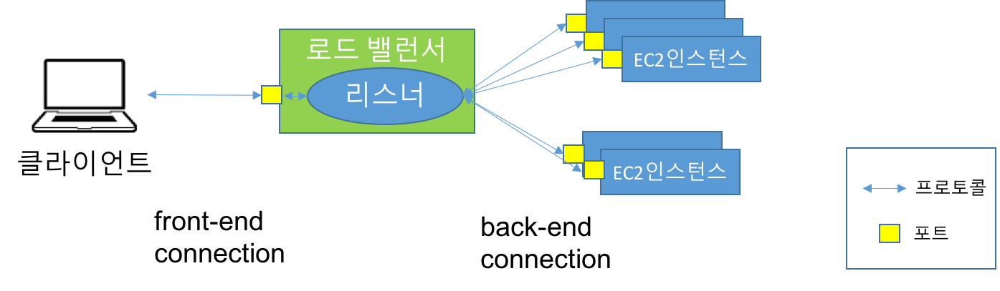
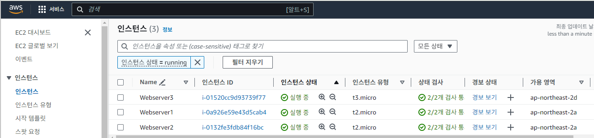
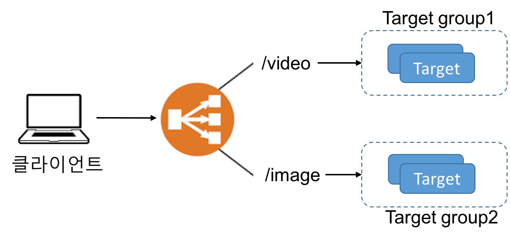
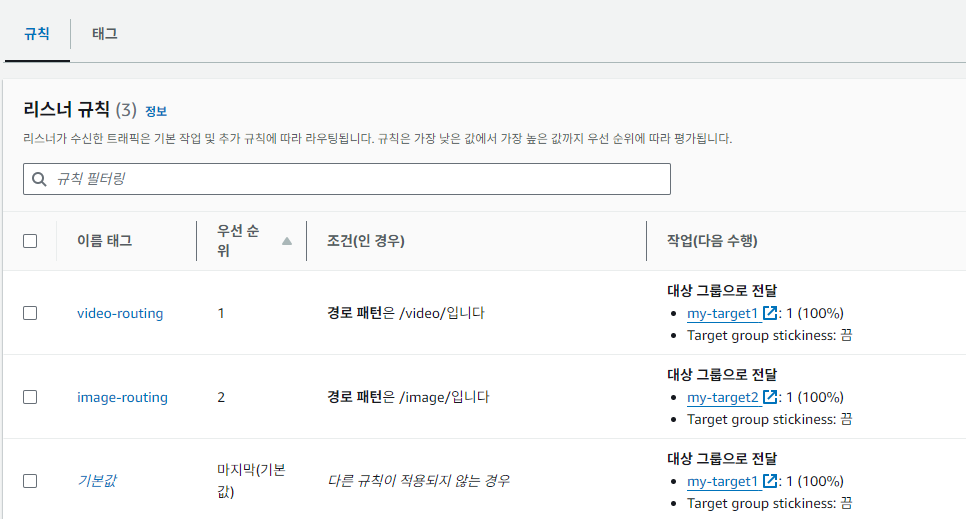

# Elastic Load Balancing
- 로드 밸런싱이란?
- Elastic Load Balancing (ELB)
- [ELB 실습](#elb-practice)

## 1. 로드 밸런싱이란?

- “In computing, load balancing improves the distribution of workloads across multiple computing resources, such as computers, a computer cluster, network links, central processing units, or disk drives…” (https://en.wikipedia.org/wiki/Load_balancing_(computing))

	

로드 밸런싱이 필요한 상황은 주로 트래픽의 분산과 시스템의 안정성을 유지하기 위해 발생합니다. 로드 밸런싱은 여러 서버 또는 리소스 간에 네트워크 트래픽을 균등하게 분산시켜 시스템 성능을 최적화하고, 고가용성과 확장성을 제공하는 데 중요한 역할을 합니다. 다음은 로드 밸런싱이 필요한 대표적인 상황들입니다.

1. 트래픽 급증 시 서버 과부하 방지
	- 상황: 웹사이트나 애플리케이션이 예상치 못한 트래픽 증가를 겪는 경우(예: 할인 행사, 인기 이벤트, 뉴스 기사 공유 등), 단일 서버가 처리할 수 없는 양의 요청이 들어올 수 있습니다.
	- 로드 밸런싱의 필요성: 여러 서버에 트래픽을 균등하게 분배하여 한 서버에 과부하가 걸리지 않도록 보장합니다. 이를 통해 서버 성능을 최적화하고, 애플리케이션의 응답 시간과 사용자 경험을 향상시킵니다.
2. 고가용성(High Availability) 요구
	- 상황: 서버 중 하나가 다운되거나 장애가 발생할 때, 애플리케이션이 중단 없이 지속적으로 서비스되도록 해야 하는 경우.
	- 로드 밸런싱의 필요성: 로드 밸런서는 실시간으로 서버의 상태를 모니터링하여, 장애가 발생한 서버로 트래픽을 보내지 않고 정상 작동하는 다른 서버로 트래픽을 자동으로 라우팅합니다. 이를 통해 무중단 서비스가 가능해집니다.
3. 확장성(Scalability) 요구
	- 상황: 애플리케이션이 성장하면서 점점 더 많은 사용자가 접속하게 될 때, 더 많은 서버를 추가해야 할 수 있습니다.
	- 로드 밸런싱의 필요성: 로드 밸런서는 새로운 서버가 추가되더라도 자동으로 트래픽을 분산하여 시스템 확장에 유연하게 대응할 수 있습니다. 서버를 추가하거나 제거할 때도 사용자 경험에 영향을 주지 않고 트래픽을 분산시켜 성능을 유지할 수 있습니다.
4. 애플리케이션 성능 최적화
	- 상황: 특정 서버에 과부하가 걸리면 응답 시간이 느려지고, 사용자 경험이 악화될 수 있습니다.
	- 로드 밸런싱의 필요성: 로드 밸런서는 서버의 CPU, 메모리, 네트워크 대역폭 사용량을 모니터링하여, 더 많은 리소스를 가진 서버나 부하가 적은 서버로 트래픽을 분산시켜 성능을 최적화합니다. 이를 통해 각 서버의 부하가 균등해지고, 성능이 일관되게 유지됩니다.

## 2. Elastic Load Balancing (ELB) 란?
**Elastic Load Balancing (ELB)**는 AWS(Amazon Web Services)에서 제공하는 로드 밸런싱 서비스로, 애플리케이션에 들어오는 트래픽을 여러 서버(인스턴스)로 분산시켜 고가용성과 확장성을 제공하는 기능입니다. ELB는 클라우드 환경에서 애플리케이션의 성능을 최적화하고, 서버의 부하를 고르게 분산하며, 장애가 발생한 서버를 자동으로 감지하여 트래픽을 다른 서버로 우회시키는 역할을 합니다

### 2.1 ELB의 주요 기능
- **트래픽 분산**: ELB는 애플리케이션에 들어오는 트래픽을 둘 이상의 가용 영역에서 EC2 인스턴스, IP 주소, Lambda 함수 등 여러 대상에 분산시킵니다. 이를 통해 서버에 과부하가 걸리는 상황을 방지하고, 애플리케이션의 성능을 유지할 수 있습니다.
- **고가용성 및 내결함성**: ELB는 여러 **가용 영역(AZ, Availability Zone)**에 걸쳐 트래픽을 분산함으로써, 하나의 서버나 가용 영역에 장애가 발생해도 다른 서버나 가용 영역으로 트래픽을 우회시킴으로써 애플리케이션이 계속 작동할 수 있도록 합니다.
- **자동 확장 지원**: ELB는 Auto Scaling과 통합되어 서버의 부하에 따라 인스턴스를 자동으로 추가하거나 제거할 수 있습니다. 트래픽이 증가하면 자동으로 더 많은 서버를 추가하고, 트래픽이 감소하면 불필요한 서버를 제거하여 비용을 절감할 수 있습니다.
- **건강 상태 확인(Health Check)**: ELB는 대상 서버의 상태를 주기적으로 모니터링하며, 비정상적인 서버는 자동으로 트래픽 분배 대상에서 제외합니다. 서버가 정상 상태로 복구되면 다시 트래픽 분배 대상에 포함됩니다.
- **교차 영역 로드 밸런싱 (Cross-Zone Load Balancing)**: 여러 가용 영역(AZ)에 걸쳐 트래픽을 고르게 분산하여 특정 가용 영역의 과부하를 방지하고 애플리케이션의 가용성을 높일 수 있습니다.
	- 교차 영역 로드 밸런싱을 활성화하면 각 로드 밸런서 노드가 활성화된 모든 가용 영역에 있는 등록된 대상 간에 트래픽을 분산

		
	
	- 교차 영역 로드 밸런싱이 비활성화된 경우 가용 영역 A에 있는 각 2개의 대상은 25%의 트래픽을 수신하고 가용 영역 B에 있는 각 8개의 대상은 트래픽의 6.25%를 수신	
	
		
- **유연한 트래픽 라우팅**: **경로 기반 라우팅(Path-based Routing)**과 **호스트 기반 라우팅(Host-based Routing)**을 지원하여, 특정 URL 경로나 도메인에 따라 트래픽을 특정 백엔드 서버로 라우팅할 수 있습니다.

### 2.2 ELB의 주요 구성요소

- **로드 밸런서 (Load Balancer)**
	- ELB의 핵심 구성 요소로, 클라이언트 요청을 수신하고 해당 요청을 백엔드 서버(대상 그룹)에 전달하는 역할을 합니다.
	- 클라이언트에 대한 단일 접점 역할을 수행
	- 로드 밸런서는 여러 가용 영역에서 EC2 인스턴스 같은 여러 대상에 수신 애플리케이션 트래픽을 분산
	- Elastic Load Balancing은 다음 유형의 로드 밸런서를 지원합니다.
		- 애플리케이션 로드 밸런서 (ALB, Application Load Balancer) 
		- 네트워크 로드 밸런서 (NLB, Network Load Balancer)
		- 게이트웨이 로드 밸런서 (Gateway Load Balancer)
		- 클래식 로드 밸런서 (Classic Load Balancer) 
- **리스너 (Listener)**
	- 로드 밸런서가 트래픽을 수신하는 포트 번호와 프로토콜(HTTP, HTTPS, TCP, UDP)을 정의하는 구성 요소
		- ALB는 HTTP/HTTPS 리스너를 지원하며, NLB는 TCP/UDP 리스너를 지원합니다.
	- 리스너에 대해 정의한 **규칙(Rule)**에 따라 로드 밸런서가 등록된 대상으로 요청을 라우팅하는 방법이 결정됨
		- 각 규칙은 우선 순위, 하나 이상의 조건, 하나 이상의 작업으로 구성됨
- **대상 그룹 (Target Group)**
	- 대상 그룹은 트래픽을 분산시킬 EC2 인스턴스, 컨테이너, IP 주소 등의 그룹을 정의
	- 로드 밸런서는 수신한 트래픽을 리스너를 통해 적절한 대상 그룹으로 라우팅하며, 대상 그룹 내에서 트래픽이 분배됩니다.
	- 대상 그룹은 **상태 확인(Health Check)**을 통해 대상이 정상인지 여부를 주기적으로 모니터링합니다.
	- 대상 그룹은 다음과 같은 유형의 대상을 포함할 수 있습니다:
		- EC2 인스턴스: 대상 그룹에 연결된 인스턴스에 트래픽을 분배합니다.
		- IP 주소: VPC 또는 온프레미스 네트워크의 IP 주소를 대상으로 설정할 수 있습니다.
		- Lambda 함수: ALB는 트래픽을 Lambda 함수로 라우팅할 수 있습니다.

### 2.2 애플리케이션 로드 밸런서
**Application Load Balancer (ALB)**는 AWS의 Elastic Load Balancer 서비스 중 하나로, HTTP와 HTTPS 트래픽을 EC2 인스턴스, IP 주소, Lambda 함수로 분배합니다. ALB는 웹 애플리케이션의 복잡한 라우팅 요구사항을 충족하고 고성능, 유연성을 제공하는 데 최적화되어 있습니다. 주로 웹 애플리케이션, API 서비스, 마이크로서비스 기반 아키텍처에 자주 사용됩니다.

#### 애플리케이션 로드 밸런서(ALB)의 특징
- **애플리케이션 계층에서 동작**: ALB는 OSI 모델의 7계층(애플리케이션 계층)에서 작동합니다. 이는 HTTP 및 HTTPS 프로토콜에 대한 심층 패킷 검사가 가능하다는 의미입니다. 이를 통해 URL, HTTP 헤더, HTTP 메서드, 쿼리 문자열, 소스 IP 주소와 같은 다양한 애플리케이션 데이터에 따라 트래픽을 정밀하게 제어하고 라우팅할 수 있습니다.
- **고급 라우팅 기능**: ALB는 다양한 고급 라우팅 기능을 지원합니다:
	- **URL 기반 라우팅**: 특정 URL 패턴에 따라 요청을 라우팅할 수 있습니다. 예를 들어, /image/는 이미지 서버로, /video/는 비디오 서버로 트래픽을 보낼 수 있습니다.
	- **호스트 기반 라우팅**: 다중 도메인을 사용하는 경우, 호스트 이름(도메인 이름)에 따라 트래픽을 라우팅할 수 있습니다. 예를 들어, api.example.com으로 들어오는 요청은 API 서버로, app.example.com은 웹 애플리케이션 서버로 보낼 수 있습니다.
	- **HTTP 헤더와 메서드 기반 라우팅**: 특정 HTTP 헤더나 메서드를 기준으로 트래픽을 나누는 라우팅이 가능합니다. 예를 들어, GET 요청과 POST 요청을 다른 백엔드 서비스로 보낼 수 있습니다.
	- **쿼리 문자열 라우팅**: 쿼리 문자열 매개변수에 따라 다른 대상 그룹(Target Group)으로 트래픽을 라우팅할 수 있습니다.
- **상태 확인(Health Check)**: ALB는 백엔드 서버의 상태를 정기적으로 모니터링하고, 비정상적인 인스턴스를 트래픽 분배에서 제외합니다. 이를 통해 항상 정상적으로 동작하는 인스턴스에만 트래픽이 전달되도록 보장합니다.
- ALB에서는 교차 영역 로드 밸런싱이 항상 활성화

### 2.3 네트워크 로드 밸런서
**Network Load Balancer (NLB)**는 AWS의 Elastic Load Balancer 서비스 중 하나로, 고성능과 낮은 지연 시간(Latency)이 필요한 트래픽을 처리하기 위한 4계층 로드 밸런서입니다. NLB는 TCP(Transmission Control Protocol) 및 UDP(User Datagram Protocol) 트래픽을 EC2 인스턴스, IP 주소, ALB로 분배하며, 주로 높은 트래픽 처리량을 요구하는 애플리케이션이나 실시간 데이터 전송을 위한 애플리케이션에서 사용됩니다. 

#### 네트워크 로드 밸런서 (NLB)의 특징
- **전송 계층(4계층)에서 동작**: NLB는 OSI 모델의 4계층(전송 계층)에서 작동하며, TCP 및 UDP 트래픽을 처리합니다. 애플리케이션 레벨에서의 라우팅이 아니라 IP 주소와 포트 번호를 기준으로 트래픽을 라우팅하기 때문에, HTTP/HTTPS 트래픽이 아닌 다른 네트워크 프로토콜에도 적합합니다.
HTTP 헤더나 URL 기반의 복잡한 라우팅 기능은 제공되지 않지만, 매우 빠른 트래픽 처리 성능을 보장합니다.
- **초당 수백만 개의 요청 처리**: NLB는 대규모 트래픽을 처리할 수 있는 고성능을 제공하며, 초당 수백만 개의 요청을 처리할 수 있습니다. 이는 게임 서버, 실시간 스트리밍, 금융 거래 시스템 등 매우 높은 처리량을 요구하는 애플리케이션에 이상적입니다.
- **정적 IP 및 Elastic IP 지원**: NLB는 각 가용 영역(AZ)에 대해 하나의 정적 IP 주소를 할당하거나, Elastic IP(AWS에서 제공하는 고정 퍼블릭 IP)를 사용할 수 있습니다. 이를 통해 각 가용 영역에서 NLB로 향하는 트래픽은 항상 동일한 고정된 IP 주소로 처리되므로, 특정 IP 주소가 필요한 환경에서 유용합니다. 가령, 보안상의 이유로 사용자는 방화벽이나 네트워크 장비에서 고정된 IP 주소를 통해서만 트래픽을 허용할 수 있습니다. 이 때, 각 가용 영역에 Elastic IP가 사용되면, NLB의 IP 주소가 고정되어, 보안 요구사항을 충족시킬 수 있습니다.
	- ALB의 경우 IP 주소가 변동되기 때문에, Client는 DNS 이름을 이용해야 합니다. 반면에 NLB는 할당된 정적 IP 및 Elastic IP를 사용한다면 IP주소로도 접근이 가능합니다.

### 2.4 게이트웨이 로드 밸런서
**Gateway Load Balancer (GWLB)**는 네트워크 트래픽을 분석하거나 처리하는 **가상 네트워크 장비(Virtual Network Appliance)**로 투명하게 전달할 수 있도록 설계된 로드 밸런서입니다. 방화벽, 침입 탐지 및 방지 시스템(IDS/IPS), 딥 패킷 검사(DPI) 등의 네트워크 트래픽 분석 장비를 사용해야 하는 환경에서, **GWLB**는 이러한 장비로 트래픽을 자동으로 라우팅하고 분산시킵니다. 이를 통해 다양한 보안 서비스나 네트워크 트래픽 분석 서비스를 손쉽게 중앙에서 관리하고 확장할 수 있게 해줍니다.

.fb86e6dd6e665cdd644cc954db02df78b2b8fd2c.png)

### 2.5 클래식 로드 밸런서
**클래식 로드 밸런서(Classic Load Balancer, CLB)**는 AWS에서 제공하는 최초의 로드 밸런싱 서비스로, EC2 Classic 네트워크에서부터 사용되기 시작했습니다. CLB는 **4계층(전송 계층, TCP)**과 **7계층(애플리케이션 계층, HTTP/HTTPS)**에서 작동하며, 기본적인 트래픽 분산과 라우팅 기능을 제공합니다. 비록 **Application Load Balancer(ALB)**와 **Network Load Balancer(NLB)**가 더 많은 기능과 성능을 제공하지만, CLB는 여전히 몇몇 단순한 로드 밸런싱 요구사항을 처리할 수 있습니다.

 
## 3. ELB 실습

### **사전준비**
- 두개의 다른 가용영역에서 있는 3개의 EC2인스턴스들을 준비한다
	- 각 인스턴스들의 웹서버 문서 루트(/var/www/html/) 하위에 다음 세개의 파일 생성
		- index.html - 인스턴스의 메인 홈페이지 (인스턴스 별로 각 파일의 콘덴츠를 별도로 정의)
		- /video/index.html – 인스턴스의 비디오 페이지 (인스턴스 별로 각 파일의 콘덴츠를 별도로 정의)
		- /image/index.html - 인스턴스의 이미지 페이지 (인스턴스 별로 각 파일의 콘덴츠를 별도로 정의)
- 하나의 가용영역 (ap-northeast-2a)에서 2개의 인스턴스(webserver1, webserver2)를 시작
	- 이 두개의 인스턴스는 my-target1의 대상 그룹에 등록될 것임
- 또 다른 가용영역 (ap-northeast-2d)에서 1개의 인스턴스(webserver3)를 시작
	- 다른 가용영역 설정은 인스턴스 시작시에 **네트워크 설정**에서 다른 서브넷을 선택하면 됨
	
	- 이 인스턴스는 이번 실습에서 my-target2의 대상 그룹에 등록될 것임
- EC2 인스턴스의 보안그룹이 80 포트의 HTTP 접근을 허용하는지 확인
- 아파치 웹서버 설치 및 실행하여, 웹서버의 웹페이지가 EC2 인스턴스의 DNS 이름으로 로드되는지 확인

### 3.1 [Application Load Balancer 시작하기](https://docs.aws.amazon.com/ko_kr/elasticloadbalancing/latest/application/application-load-balancer-getting-started.html)

### 3.2 경로 기반 라우팅 실습22
- 실습 시나리오
	
	- URL 경로를 기반으로 라우팅하는 규칙을 리스너에 추가
	

- **단계1: 첫번째 대상그룹 생성**
	1. 왼쪽 탐색창 메뉴의 [**LOAD BALANCING**]의 [**대상 그룹(Target Groups)**] 선택
	2. [**대상 그룹 생성(Create target group)**] 클릭
		- [**대상 그룹 이름(Target group name)**] 에서 대상 그룹 이름 지정 (예, *my-target1*)
		- 나머지 항목(프로토콜, 포트, IP 주소 유형, VPC, 상태 검사 설정(프로토콜, 경로))은 기본값 유지
		- [**다음**] 클릭
	5. 하나이상의 인스턴스(webserver1, webserver2)를 선택하고, [**아래에 보류 중인 것으로 포함**] 클릭 후, [**대상 그룹 생성**] 클릭
	
- **단계2: 두번째 대상그룹 생성**
	1. [**대상 그룹 생성(Create target group)**] 클릭
		- [**대상 그룹 이름(Target group name)**] 에서 대상 그룹 이름 지정 (예, *my-target2*)
		- 나머지 항목(프로토콜, 포트, IP 주소 유형, VPC, 상태 검사 설정(프로토콜, 경로))은 기본값 유지
		- [**다음**] 클릭
	5. 하나이상의 인스턴스(webserver3)를 선택하고, [**아래에 보류 중인 것으로 포함**] 클릭 후, [**대상 그룹 생성**] 클릭
	
- **단계3:로드 밸런서 타입 선택1**
	1. 왼쪽 탐색 창 매뉴의 [**LOAD BALANCING**]에서 [**로드밸런서(Load Balancers)**]를 선택
    2. [**로드 밸런서 생성(Create Load Balancer)**] 클릭
	3. **Application Load Balancer**의 **생성**를 클릭

- **단계5: 로드 밸런서 구성2**
	1. **이름** : 이름 입력 (해당 리전에서 고유한 이름): 예, path-based-alb
	2. **방식**: 기본값 유지 (*인터넷 경계*)
	3. [**로드 밸런서 IP 주소 유형**]: 기본값 유지 (*ipv4*)
	4. [**가용 영역**]: 
		- VPC를 선택: 기본 VPC 선택 유지
		- 두개 이상의 가용 영역(ap-northeast-2a, ap-northeast-2d)의 서브넷 선택 
	5. [**보안 그룹**] :  이전 실습에서 사용했던 보안그룹 선택
	3. [**리스너 및 라우팅**] 
		- 기본 프로토콜과 포트를 유지하고 목록에서 대상 그룹 (*my-target1*) 을 선택
		- 구성을 검토하고 **로드 밸런서 생성(Create load balancer)**을 선택

- **단계 5: 리스너 설정**
	1. 새롭게 생성된 로드 밸런서를 선택
	2. [**리스너 및 규칙**] 탭에서 생성된 리스너의 규칙을 보기 위해, 생성된 리스너를 선택한 후에, [**규칙 관리> 규칙 편집**] 클릭
	
	3. 화면 상단의 [**규칙 추가**]을 클릭한 후
	4. 경로 기반 라우팅으로서 **/video/**의 요청에 대해서 *my-target1*으로 전달하는 규칙 추가
		- [**이름 및 태그**]에서 Name에  *video-routing* 같이 설정
		- [**조건 추가**] 선택
			- 규칙 조건 유형으로 [**조건 선택**] 드롭다운 메뉴에서 *경로*를 선택
			- 경로 값으로 */video/*을 입력 
		- [**작업**]에서 *대상 그룹으로 전달*을 선택하고, [**대상 그룹**]에서 *my-target1*을 선택 후 [**다음**] 클릭
		- 규칙 우선 순위 결정에서 우선순위로 1~50000 사의의 값 중 하나를 지정 후 [**다음**] 클릭
		- 검토 및 생성 후에 [**생성**] 클릭
	5. 같은 방법으로, 경로 기반 라우팅으로서 */image/**의 요청에 대해서 *my-target2*으로 전달하는 규칙 추가
	6. 두개의 규칙을 추가 한 후의 결과
		

- **단계 6: 테스트**
	1. 왼쪽 탐색 창 메뉴의 [**LOAD BALANCING**]의 [**로드 밸런서**]를 선택
	2. [**설명**] 탭에서 로드밸런서의 DNS 이름 값을 복사해서 웹브라우저에서 테스트

		- 아래의 주소를 입력후, 새로고침을  3번이상 수행하여 결과를 확인
			- http://path-based-elb-xxx.elb.amazonaws.com/video/ 
				- my-target1 대상 그룹의 인스턴스들이 Response
			- http://path-based-elb-xxx.elb.amazonaws.com/
				- my-target1 대상 그룹의 인스턴스들이 Response
			- http://path-based-elb-xxx.elb.amazonaws.com/image/ 
				- my-target2 대상 그룹의 인스턴스들이 Response

			- 위의 (path-based-elb-xxx.elb.amazonaws.com) 주소는 로드밸런서의 DNS name 값 임

 
