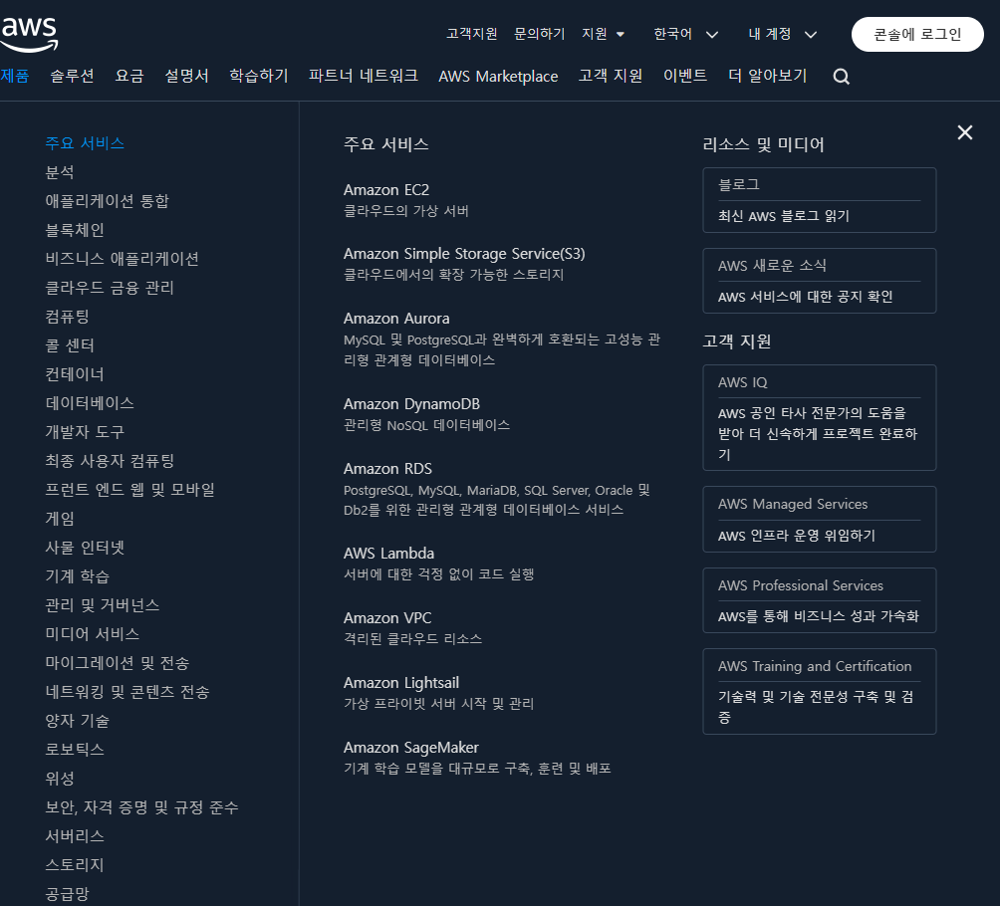
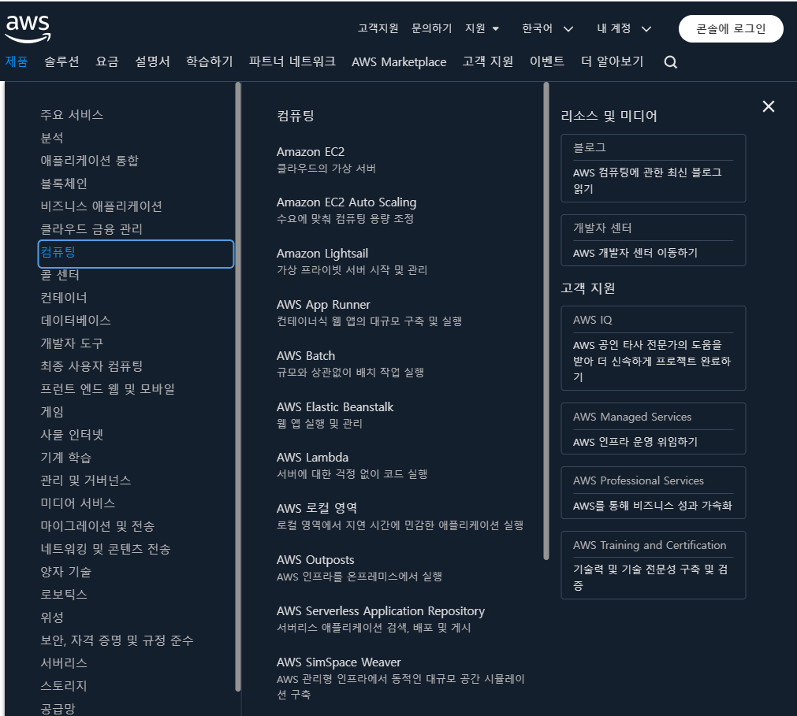
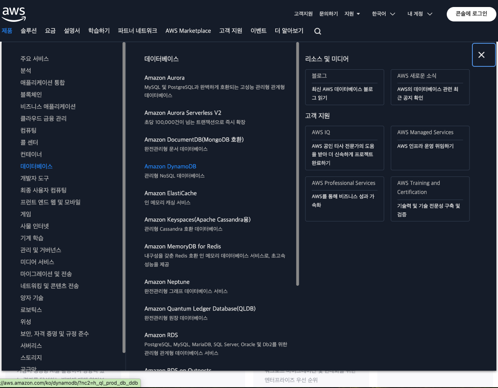
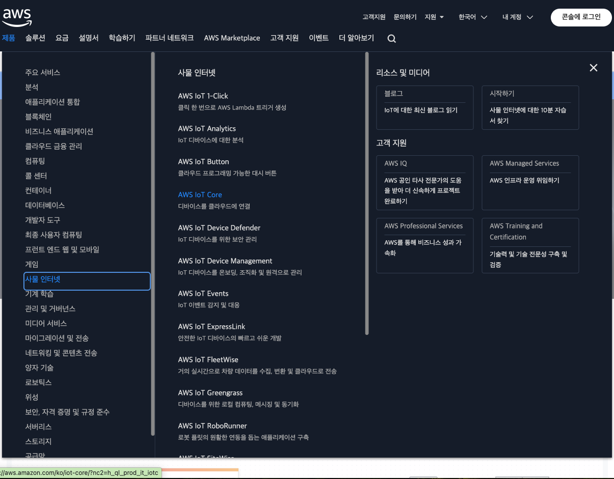
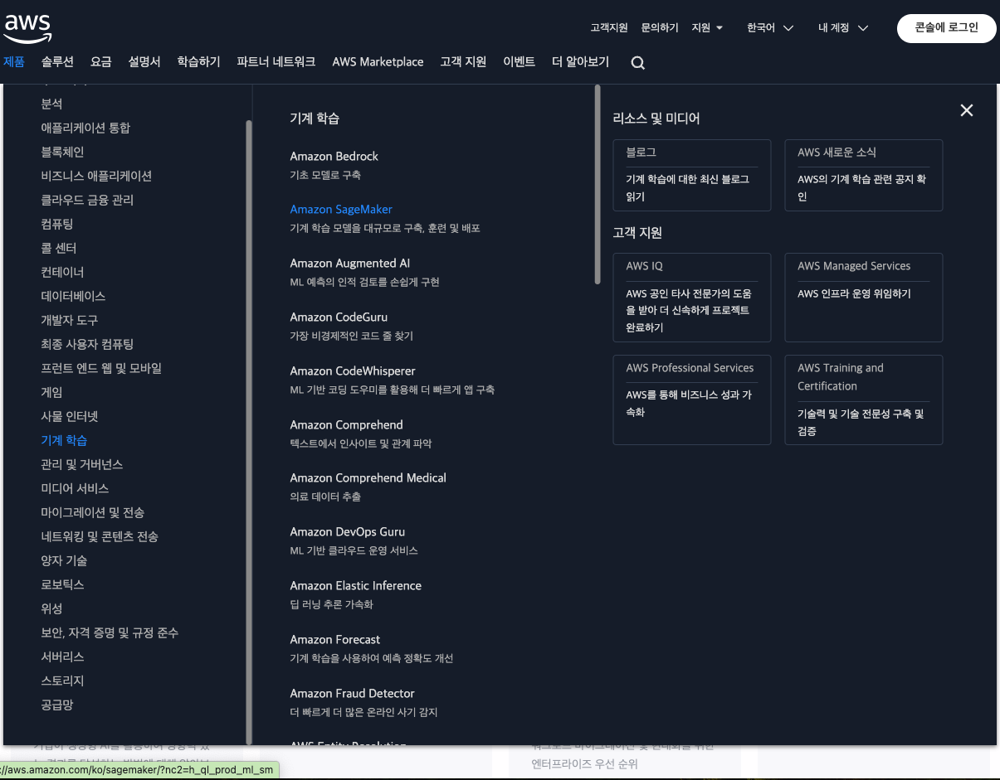
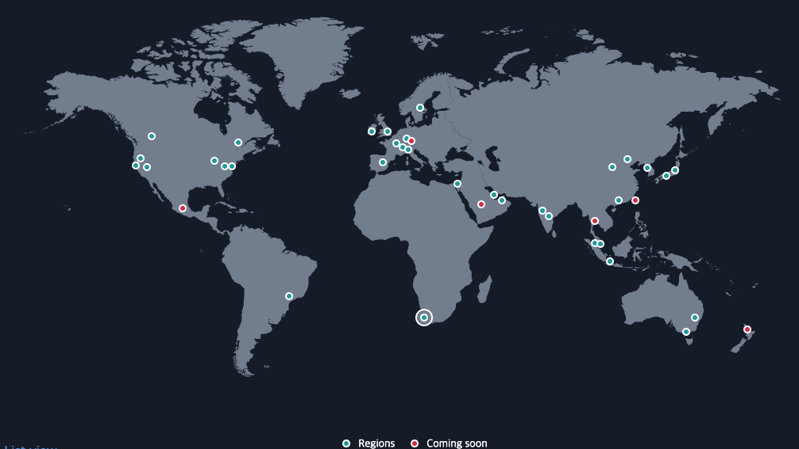
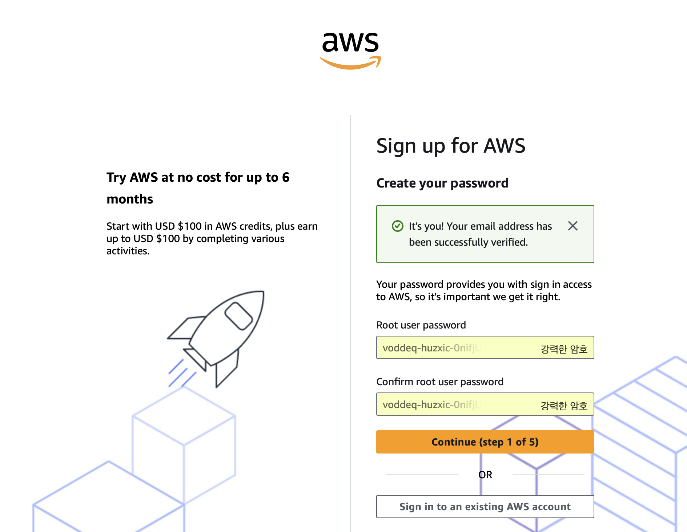
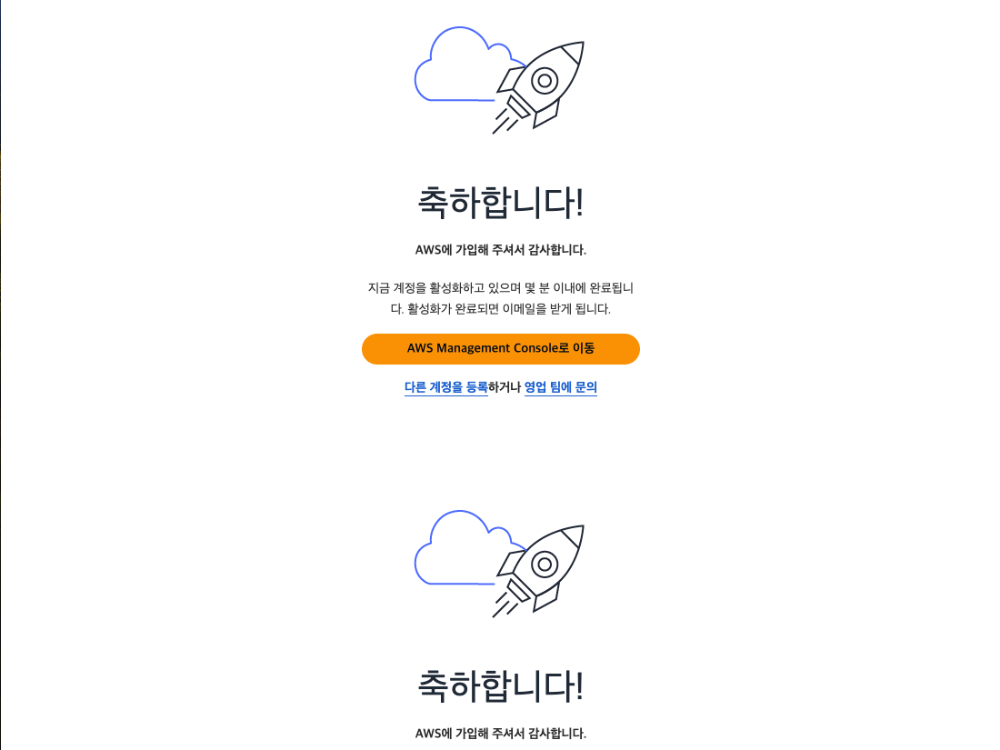
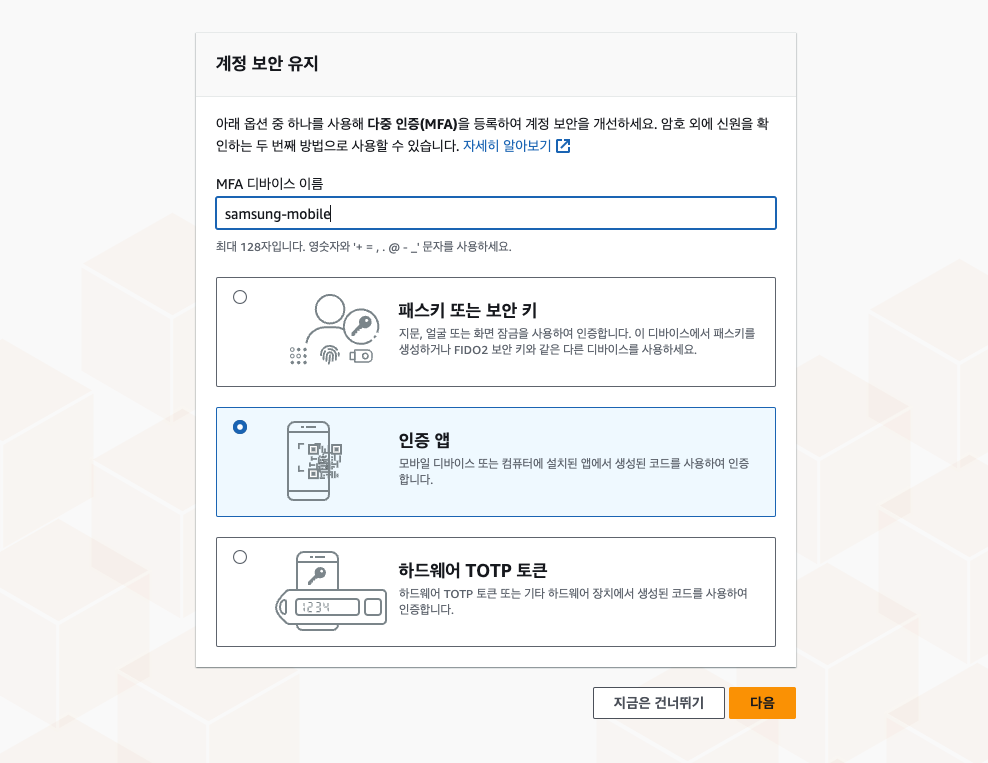

# AWS 소개
- 아마존 웹 서비스 (AWS) 등장 배경
- AWS 주요 서비스
- AWS 클라우드 구조
- AWS 계정생성 (회원 가입)

## 1. 아마존 웹 서비스 (AWS) 등장 배경
AWS(Amazon Web Services)의 역사는 2000년대 초반으로 거슬러 올라갑니다. Amazon은 원래 전자상거래를 위한 기술 인프라로 시작했지만, 내부적으로 대규모 인프라를 효과적으로 관리하면서 얻은 경험을 바탕으로 클라우드 컴퓨팅 서비스의 기초를 쌓았습니다. AWS는 이러한 배경에서 출발하여 오늘날 세계에서 가장 큰 클라우드 컴퓨팅 플랫폼 중 하나로 성장했습니다. AWS의 역사를 간략히 살펴보면 다음과 같습니다.

### 1.1 초기 시작 (2000년대 초반)
Amazon은 자사 전자상거래 사이트의 인프라를 관리하면서 확장성, 유연성, 안정성의 중요성을 깨닫게 되었습니다. 이에 따라 Amazon 내부에서는 보다 효율적이고 확장 가능한 인프라를 구축하기 위한 작업이 시작되었습니다. 이 과정에서 얻은 경험과 기술을 바탕으로, 다른 기업들에게도 IT 인프라 서비스를 제공할 수 있겠다는 아이디어가 나오게 됩니다.

### 1.2 AWS 출범 (2006년)
2006년, AWS는 처음으로 클라우드 컴퓨팅 서비스를 공식적으로 출시하였습니다. 그 시작은 **S3(Simple Storage Service)**와 **EC2(Elastic Compute Cloud)**였습니다.
- S3는 무제한의 스토리지를 제공하며, 인터넷에서 파일을 안전하게 저장하고 검색할 수 있도록 설계되었습니다.
- EC2는 사용자가 원하는 대로 가상 서버를 쉽게 생성하고 관리할 수 있도록 해주는 컴퓨팅 리소스를 제공했습니다.

이 두 서비스는 클라우드 컴퓨팅의 기초를 마련했고, 기업들이 기존의 물리적 서버와 데이터센터 대신 클라우드 인프라를 사용하도록 변화시키는 계기가 되었습니다.

### 1.3 AWS의 성장과 새로운 서비스 추가 (2007-2010년대)
AWS는 출범 이후 빠르게 성장하며 다양한 서비스를 추가했습니다.
- 2007년: Simple Queue Service(SQS) 출시. 이는 메시징 서비스로, 분산 애플리케이션 간의 데이터 전달을 관리합니다.
- 2009년: CloudFront, RDS(Relational Database Service) 등의 서비스가 출시되어 AWS가 단순한 스토리지와 컴퓨팅 제공을 넘어 네트워크 및 데이터베이스 관리 기능까지 확장되었습니다.
- 2011년: Elastic Beanstalk, AWS Identity and Access Management(IAM) 등의 관리 도구들이 출시되어 AWS는 사용자의 개발, 관리, 보안 요구 사항에 부합하는 포괄적인 솔루션으로 발전했습니다.

### 1.4 글로벌 확장 및 주요 전환점 (2010년대 중반)
AWS는 2010년대 중반부터 세계 각지에 데이터 센터를 확장하여 클라우드 인프라를 글로벌하게 제공하기 시작했습니다. 특히 대규모 기업들이 AWS를 도입하면서 AWS의 성장이 가속화되었습니다. 이 시기에는 다음과 같은 주요 서비스들이 출시되었습니다.

- 2012년: AWS Marketplace 출시. 이는 사용자가 쉽게 소프트웨어를 구매하고 배포할 수 있는 플랫폼입니다.
- 2014년: Lambda 출시. 서버리스 컴퓨팅의 시작으로, 이벤트 기반으로 코드를 실행하는 방식의 혁신적인 컴퓨팅 모델을 제공했습니다.
- 2015년: AWS IoT와 AWS Machine Learning 서비스가 추가되며, 사물 인터넷과 인공지능/머신러닝 분야로 확장되었습니다.

### 1.5 클라우드 시장에서의 리더십 (2016년 이후)
2016년, AWS는 이미 클라우드 컴퓨팅 시장의 절대적인 리더로 자리 잡았으며, 전 세계 수백만 고객을 보유하게 되었습니다. 주요 고객으로는 Netflix, Airbnb, Spotify, NASA 등이 있으며, AWS를 사용해 다양한 규모의 애플리케이션을 실행하고 있습니다.

AWS는 지속적으로 인프라 확장과 함께 새로운 서비스를 출시해왔으며, 인공지능(AI), 머신러닝(ML), 빅데이터, 컨테이너 관리 등 최신 기술 분야에서 강력한 서비스를 제공하고 있습니다. 또한 Outposts와 같은 온프레미스 하이브리드 클라우드 솔루션을 통해, 기업이 클라우드와 자체 데이터센터 간의 연결을 원활하게 할 수 있는 환경도 제공하고 있습니다.

### 1.6 현재와 미래
AWS는 현재도 클라우드 컴퓨팅 시장의 가장 큰 점유율을 차지하고 있으며, 새로운 기술 도입과 서비스 확장을 통해 성장세를 유지하고 있습니다. AWS는 지속적으로 보안, 확장성, 비용 효율성, 혁신을 기반으로 고객 요구에 맞는 솔루션을 개발하고 있으며, 많은 기업들이 디지털 트랜스포메이션을 위해 AWS를 선택하고 있습니다.

AWS의 미래는 인공지능, 머신러닝, IoT, 엣지 컴퓨팅, 하이브리드 클라우드 등과 같은 최신 기술을 중심으로 계속해서 발전해 나갈 것으로 예상됩니다.

## 2. AWS 주요 서비스
- https://aws.amazon.com/ko/ 의 *제품* > *주요서비스*

- **컴퓨팅** : https://aws.amazon.com/ko/ 의 *제품* > *컴퓨팅*

- **데이터베이스** : https://aws.amazon.com/ko/ 의 *제품* > *데이터베이스*

- **사물인터넷** : https://aws.amazon.com/ko/ 의 *제품* > *사물인터넷*

- **기계학습** : https://aws.amazon.com/ko/ 의 *제품* > *기계학습*

## 3. AWS 클라우드 구조
AWS 클라우드는 37개 지리적 리전 내의 가용 영역 117개에 걸쳐 있습니다.

### 3.1 리전
AWS의 **리전(Region)**은 지리적으로 분리된 물리적 데이터 센터의 집합으로, AWS 클라우드 인프라의 주요 구성 요소입니다. 각 리전은 독립적인 리소스와 데이터센터를 가지고 있으며, 사용자는 특정 리전을 선택해 클라우드 자원을 배치하고 운영할 수 있습니다.

1. 리전의 구조
	하나의 리전은 여러 가용 영역(AZ)으로 구성되며, 각 가용 영역은 물리적으로 분리된 데이터 센터입니다. 이를 통해 고가용성과 장애 복구 능력을 제공합니다.

2. 리전 선택의 중요성

	리전은 사용자 또는 애플리케이션의 요구 사항에 따라 신중하게 선택해야 합니다. 다음은 리전 선택 시 고려해야 할 몇 가지 요소입니다.

	- 지연 시간(Latency): 사용자가 애플리케이션을 사용하는 위치에 가까운 리전을 선택하면, 네트워크 지연을 최소화할 수 있습니다. 이는 특히 실시간 응답이 중요한 애플리케이션이나 게임 서비스에 필수적입니다.
	- 데이터 규정 및 법적 요구사항: 일부 국가나 지역은 데이터 저장 위치에 대한 법적 요구사항을 가지고 있습니다. 예를 들어, 유럽 연합(EU) 내의 데이터는 GDPR 규정을 준수해야 하므로 유럽 리전을 선택하는 것이 중요합니다.
	- 비용(Cost): 리전에 따라 서비스의 가격이 다를 수 있습니다. 리전마다 운영 비용, 전력 비용 등이 다르기 때문에 사용자는 비용 측면에서 가장 적합한 리전을 선택할 수 있습니다.
	- 서비스 가용성: AWS의 일부 서비스는 모든 리전에서 제공되지 않을 수 있습니다. 예를 들어, 최신 서비스는 특정 리전에서 먼저 제공되고 다른 리전으로 점차 확장됩니다. 따라서 필요한 서비스가 제공되는 리전을 선택하는 것이 중요합니다.

3. 리전의 실제 사례

	AWS는 전 세계에 걸쳐 수십 개의 리전을 운영하고 있으며, 각 리전은 다음과 같은 형태로 구분됩니다:

	- 미국 동부(버지니아 북부), 미국 서부(오레곤), 유럽(아일랜드), 아시아 태평양(서울) 등.

	각 리전은 고유한 코드로 식별되며, 예를 들어 us-east-1은 미국 동부(버지니아 북부) 리전을 의미하고, ap-northeast-2는 아시아 태평양(서울) 리전을 의미합니다.

4. 멀티 리전 전략

	AWS에서는 고가용성 및 데이터 중복성을 보장하기 위해 멀티 리전 아키텍처를 채택할 수 있습니다. 이를 통해 여러 리전에 데이터를 분산하고, 한 리전에 문제가 발생해도 다른 리전에서 서비스를 계속 제공할 수 있습니다. 이 전략은 다음과 같은 이점을 제공합니다:

	- 지속적인 가용성(Continuous Availability): 한 리전에서 발생한 장애가 다른 리전에 영향을 미치지 않기 때문에, 서비스의 연속성을 유지할 수 있습니다.
	- 재해 복구(Disaster Recovery): 주요 서비스와 데이터를 여러 리전에 분산함으로써, 자연 재해나 기타 장애 상황에서 빠르게 복구할 수 있습니다.

AWS의 리전 구조는 전 세계 사용자를 위한 고성능, 안정성, 확장성을 제공하는 중요한 클라우드 인프라 구성 요소입니다. 리전의 선택은 애플리케이션의 성능, 비용, 법적 요구사항 등 다양한 요소를 고려하여 신중하게 이루어져야 하며, 멀티 리전 전략을 통해 더욱 탄력적이고 안정적인 클라우드 환경을 구축할 수 있습니다.

### 3.2 가용영역 (Availability Zone)
**가용 영역(Availability Zone, AZ)**은 AWS의 리전(Region) 내에 물리적으로 분리된 데이터 센터입니다. AWS의 글로벌 인프라에서 가용 영역은 고가용성, 내결함성, 확장성을 제공하는 핵심 요소입니다. 

1. 가용 영역의 구조

	- 물리적 독립성: 가용 영역은 전력, 냉각, 네트워크 인프라가 완전히 독립된 상태로 운영됩니다. 물리적으로 분리된 여러 데이터 센터로 구성되어 있기 때문에 한 가용 영역에서 문제가 발생해도 다른 가용 영역은 영향을 받지 않습니다. 이 구조는 장애 복구 및 고가용성의 핵심입니다.
	- 저지연 네트워크 연결: 각 가용 영역은 저지연성(highly low-latency)의 네트워크를 통해 서로 연결되어 있습니다. 따라서 여러 AZ에 분산된 애플리케이션과 데이터베이스가 빠르고 안정적으로 통신할 수 있습니다. 이 네트워크 연결을 통해 여러 AZ에 걸친 서비스를 제공하는 것이 가능해집니다.

2. 가용 영역 활용 전략

	가용 영역은 AWS에서 애플리케이션을 더 안정적이고 탄력적으로 운영하기 위해 필수적인 구성 요소입니다. 이를 최대한 활용하기 위해 다양한 전략이 사용됩니다.

	- 멀티 AZ 배포: AWS에서는 다양한 서비스에서 멀티 AZ 배포를 지원합니다. 예를 들어, Amazon RDS는 여러 AZ에 걸쳐 데이터베이스 인스턴스를 복제하여 장애 발생 시에도 자동으로 장애를 감지하고 백업 인스턴스로 전환합니다. 이로써 데이터베이스의 지속적인 가용성을 보장합니다.
	- 로드 밸런싱: 가용 영역 간에 트래픽을 분산시키기 위해 AWS에서는 Elastic Load Balancer(ELB)와 같은 서비스를 제공합니다. ELB는 트래픽을 여러 AZ에 배치된 인스턴스들에 균등하게 분배하여 각 AZ에 걸쳐 서비스가 안정적으로 운영되도록 지원합니다.
	- 데이터 복제 및 백업: S3, EBS 등의 스토리지 서비스도 멀티 AZ에 데이터를 복제하여 고내구성을 제공합니다. S3는 데이터를 여러 AZ에 자동으로 복제하여 데이터를 안전하게 보호하며, EBS 볼륨도 스냅샷을 사용하여 다른 AZ로 복제할 수 있습니다.

3. 가용 영역 선택 시 고려 사항

	- 애플리케이션 가용성 요구: 고가용성이 중요한 애플리케이션의 경우, 반드시 여러 가용 영역에 애플리케이션을 배포해야 합니다. 예를 들어, 금융 서비스나 실시간 데이터 처리 애플리케이션은 장애 발생 시에도 빠르게 복구되어야 하므로 가용 영역 간 배포가 필수적입니다.
	- 비용: 멀티 AZ 배포는 장애 복구와 고가용성 측면에서 큰 이점을 제공하지만, 여러 AZ에 인스턴스나 서비스를 복제하면 비용이 증가할 수 있습니다. 따라서 비용과 성능 요구 사항을 잘 고려하여 AZ 전략을 설계하는 것이 중요합니다.
	- 성능 최적화: 여러 AZ에 리소스를 배치하면 지연 시간이 약간 발생할 수 있습니다. 특히 데이터베이스와 같은 고성능 애플리케이션의 경우, AZ 간 지연 시간이 영향을 미칠 수 있으므로 성능을 최적화하기 위한 적절한 네트워크 구성과 리소스 배치가 필요합니다.

4. 실제 사용 사례

	- Amazon EC2: EC2 인스턴스는 가용 영역 내에서 생성되며, 사용자는 애플리케이션을 하나의 AZ에 배포할 수 있지만, 더 높은 가용성과 내결함성을 위해 여러 AZ에 걸쳐 인스턴스를 배포하는 것이 권장됩니다.
	- Amazon RDS: RDS는 관계형 데이터베이스 서비스를 제공하며, 자동으로 여러 가용 영역에 데이터를 복제하여 장애 발생 시에도 데이터베이스의 지속적인 운영을 보장합니다.
	- Elastic Load Balancer(ELB): 여러 AZ에 걸쳐 배포된 EC2 인스턴스에 트래픽을 균등하게 분산시켜 애플리케이션의 가용성을 높입니다.

5. AZ 코드와 실제 위치

	AWS의 가용 영역(AZ)의 코드와 실제 위치는 모든 AWS 계정에서 동일한 실제 위치를 공유하지만, 각 계정에서는 가용 영역 코드가 다르게 보일 수 있습니다. 이는 AWS의 가용성을 극대화하고 리소스 분산을 용이하게 하기 위한 설계입니다.

	- AZ 코드: AWS에서 가용 영역은 각 리전 내에서 특정 코드로 표시됩니다. 예를 들어, 미국 동부(버지니아 북부) 리전에서는 가용 영역이 us-east-1a, us-east-1b, us-east-1c와 같은 코드로 표시됩니다.
	- 실제 위치: 이 가용 영역 코드가 계정마다 다르게 보일 수 있지만, 물리적인 데이터 센터는 모든 계정에서 동일합니다. 즉, 계정 A에서 us-east-1a로 보이는 가용 영역이 계정 B에서는 us-east-1b로 보일 수 있지만, 두 계정에서 가리키는 데이터 센터는 동일한 위치에 있습니다.

	AWS는 가용 영역을 계정마다 다른 코드로 표시함으로써, 사용자가 실수로 모든 리소스를 동일한 AZ에 배치하지 않도록 합니다. 이 방식은 자연스럽게 리소스를 여러 가용 영역에 분산 배치하도록 유도하며, 이는 고가용성과 내결함성을 높이는 데 기여합니다.

### 3.3 글로벌 서비스와 리전 서비스
AWS에서는 클라우드 서비스가 글로벌 서비스와 리전 서비스로 구분됩니다. 이 구분은 서비스가 제공되는 범위와 사용 방식에 따라 이루어지며, 각 서비스의 특성에 맞는 운영 방식에 따라 나뉩니다.

1. 글로벌 서비스 (Global Services)

	글로벌 서비스는 특정 리전에 제한되지 않고, 전 세계 어디서나 사용할 수 있는 서비스입니다. 이러한 서비스는 AWS 인프라 전체에 걸쳐 작동하며, 여러 리전에 걸친 데이터를 관리하거나 사용자 간의 연결을 쉽게 지원하는 데 적합합니다.

	주요 글로벌 서비스

	- IAM (Identity and Access Management): AWS 계정에서 사용자, 그룹, 역할, 정책 등을 관리하는 보안 서비스입니다. 글로벌 서비스이기 때문에 리전에 구애받지 않고 사용자 권한을 관리할 수 있습니다.
	- Route 53: AWS의 도메인 이름 시스템(DNS) 웹 서비스로, 도메인 이름을 관리하고 글로벌 트래픽을 라우팅하는 데 사용됩니다. Route 53은 전 세계 어디서나 동일한 방식으로 도메인 이름을 관리할 수 있습니다.
	- CloudFront: 콘텐츠 전송 네트워크(CDN) 서비스로, 전 세계의 여러 엣지 로케이션을 통해 정적 및 동적 콘텐츠를 전송합니다. CloudFront는 글로벌 네트워크를 사용하여 전 세계적으로 빠르고 안전하게 콘텐츠를 제공할 수 있습니다.
	- AWS WAF (Web Application Firewall): 웹 애플리케이션을 보호하는 서비스로, 글로벌 트래픽을 모니터링하고 악의적인 요청을 차단하는 역할을 합니다. 이 서비스는 글로벌 차원에서 보안 정책을 적용합니다.
	-Amazon S3 (글로벌 버킷 이름 스페이스): S3 자체는 리전 기반이지만, 버킷 이름은 글로벌로 유일해야 합니다. 즉, 전 세계적으로 고유한 버킷 이름을 사용해야 한다는 점에서 글로벌 특성을 가집니다.

	글로벌 서비스의 장점

	- 글로벌 확장성: 하나의 글로벌 계정으로 전 세계에서 동일한 설정과 서비스를 사용할 수 있습니다.
	- 통합 관리: 글로벌 리소스나 사용자를 통합적으로 관리할 수 있어 여러 리전에서 일관된 운영이 가능합니다.

2. 리전 서비스 (Region-Specific Services)

	리전 서비스는 특정 리전 내에서만 작동하는 서비스입니다. 이는 각 리전의 물리적 데이터 센터에서 운영되며, 지리적 위치와 데이터 규정, 성능 요구 사항 등에 따라 선택적으로 사용할 수 있습니다. 리전 서비스는 특정 리전 내에서 데이터 저장, 컴퓨팅 자원 제공 등 리소스 중심의 서비스를 제공합니다.

	주요 리전 서비스

	- Amazon EC2 (Elastic Compute Cloud): 리전 기반의 가상 서버 서비스로, 사용자는 특정 리전에 가상 인스턴스를 배포하고, 그 리전 내에서 컴퓨팅 리소스를 사용할 수 있습니다. 각 리전에서 독립적으로 동작하며, 리전 간에 인스턴스가 자동으로 이동할 수는 없습니다.
	- Amazon RDS (Relational Database Service): 관계형 데이터베이스 서비스로, 특정 리전 내에서 데이터베이스 인스턴스를 생성하고 운영합니다. 고가용성을 위해 멀티 AZ 배포가 가능하지만, 리전 간 자동 데이터베이스 복제는 기본 제공되지 않습니다.
	- Amazon S3 (Simple Storage Service): S3는 리전 단위로 데이터를 저장합니다. 각 리전에 독립적인 버킷을 생성하고, 데이터를 리전 내에 저장할 수 있습니다. 필요에 따라 다른 리전으로 데이터를 복사하거나 전송할 수 있습니다.
	- Amazon EBS (Elastic Block Store): EC2 인스턴스에 연결되는 블록 스토리지 서비스로, 특정 리전 및 가용 영역 내에서만 사용할 수 있습니다. 리전 간 복제는 수동으로 처리해야 합니다.
	- Amazon VPC (Virtual Private Cloud): 리전 단위의 네트워크 서비스로, 사용자는 특정 리전 내에서만 가상 네트워크를 설정하고 운영할 수 있습니다. 다른 리전의 VPC와 연결하려면 VPC 피어링이나 AWS Transit Gateway와 같은 추가 기능이 필요합니다.

	리전 서비스의 장점

	- 데이터 주권(Data Sovereignty): 특정 리전에 데이터를 저장할 수 있기 때문에, 국가나 지역의 데이터 규정을 준수하는 데 유리합니다. 예를 들어, 유럽연합의 GDPR 준수를 위해 유럽 리전에 데이터를 저장할 수 있습니다.
	- 성능 최적화: 사용자와 가까운 리전을 선택하여 지연 시간(Latency)을 최소화하고 성능을 최적화할 수 있습니다. 이는 전 세계에 분산된 사용자에게 빠른 응답 속도를 제공하는 데 유리합니다.

## 4. AWS 계정생성 (회원 가입)
AWS 계정 가입 절차는 비교적 간단하지만, 몇 가지 단계가 포함됩니다. 아래는 AWS 계정을 생성하고 사용할 수 있는 준비 상태까지의 전체 절차를 자세히 설명한 것입니다.

1. AWS 홈페이지 방문

	- AWS 계정을 생성하려면 AWS 홈페이지로 이동하고, 홈페이지 오른쪽 상단에 있는 “AWS 계정 생성” 버튼을 클릭합니다.
	- 또는 다음 [링크](https://signin.aws.amazon.com/signup?request_type=register)를 클릭하여 계정 생성을 시작합니다.
	

2. 이메일 및 비밀번호 입력
	
	- 이메일 주소 입력: AWS 계정에 사용할 유효한 이메일 주소를 입력합니다. 이 이메일 주소는 계정에 로그인하고 AWS에서 발송되는 알림을 수신하는 데 사용됩니다.
	- AWS 계정 이름: 계정 이름(예: 회사 이름 또는 개인 이름)을 입력합니다.
	- **이메일 주소 확인** 버튼을 누른 후, 이메일로 전송된 확인코드를 입력합니다.
	
	- 비밀번호 설정: 로그인에 사용할 강력한 비밀번호를 입력하고 확인합니다.
	
3. 계정 계획 선택

	Free 또는 Paid를 선택합니다. 
	- Free 계정: 학습, 실험, 프로토타입 개발에 적합
	- Paid 계정: 프로덕션에 바로 적용 가능한 워크로드 개발 적합

4. 연락처 정보 입력

	- 개인 또는 회사 정보를 입력합니다.
	- 국가/지역, 전화번호, 주소와 같은 필수 정보를 제공합니다.
	
5. 결제 정보 제공
	- 계정 확인 및 사기 방지를 위해 3~5일 동안 미화 1달러(또는 이에 상응하는 금액)를 보관하는 확인 절차가 진행됩니다.
	- 무료 플랜의 경우, 유료 플랜으로 업그레이드하기 전까지는 요금이 부과되지 않습니다. 지금 결제 정보를 제공하시면 유료 플랜으로 원활하게 업그레이드하실 수 있습니다.
	
	- 카드 인증 페이지가 나오면 카드 정보를 입력하고 **다음** 버튼을 누릅니다.

6. 신원 확인 절차
	- 전화 확인: 전화번호를 입력하면 AWS에서 자동으로 전화를 걸어 4자리 PIN을 제공하고, 이를 웹사이트에 입력하는 절차를 통해 신원을 확인합니다.
	- 이 단계는 계정 보안을 강화하고, 사용자가 본인임을 확인하기 위한 절차입니다.
	
	

7.  계정 활성화

	계정 생성 절차를 완료한 후, AWS 계정이 활성화될 때까지 몇 분이 걸릴 수 있습니다. AWS는 계정이 활성화되면 확인 이메일을 발송합니다.
	
	

9. AWS Management Console 로그인

	계정이 활성화된 후, 사용자는 AWS Management Console에 로그인할 수 있습니다. AWS 관리 콘솔은 웹 기반의 인터페이스로, AWS 서비스를 탐색하고 설정할 수 있는 곳입니다.

	- "**Sign in using root email**"을 클릭
	
	- 로그인할 때 이메일 주소와 설정한 비밀번호를 사용합니다.
	- 이메일로 전달된 검증 코드를 입력합니다.

10. 계정 보안 설정 (Optional, Strongly Recommended)

	계정 보안을 강화하기 위해 다음 단계를 추가로 설정하는 것이 좋습니다.

	- MFA(Multi-Factor Authentication) 설정: AWS 계정에 다중 인증을 추가하여 보안을 강화할 수 있습니다. 이를 위해 AWS 관리 콘솔에서 MFA 기기를 설정하여 로그인할 때마다 추가 인증을 요구하도록 할 수 있습니다.
	
	- IAM 사용자 및 역할 생성: AWS 관리 콘솔의 보안 권장 사항에 따라 루트 계정 대신 IAM 사용자를 생성하고, 권한에 따라 역할을 분리하여 사용하는 것이 좋습니다.

11. 로그인 완료된 AWS Management Console 화면

	

