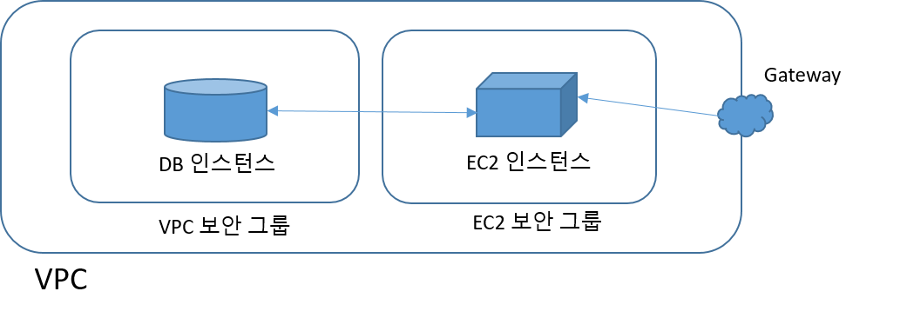

# Amazon RDS 

## 1. Amazon RDS (Relational Database Service) 란?
Amazon RDS(Amazon Relational Database Service)는 **AWS(Amazon Web Services)**에서 제공하는 관리형 관계형 데이터베이스 서비스입니다. RDS는 사용자가 데이터베이스 관리의 복잡성을 줄이고, 고가용성과 확장성을 갖춘 관계형 데이터베이스를 손쉽게 구축, 운영, 확장할 수 있도록 지원합니다. 이를 통해 데이터베이스의 설치, 패치, 백업, 복구, 모니터링 등을 자동화하여 사용자는 애플리케이션 개발과 데이터 활용에 집중할 수 있습니다.

### 1.1 주요 특징

1. **관리형 서비스:**
    - Amazon RDS는 데이터베이스의 설치, 유지 관리, 백업, 소프트웨어 패치 등을 자동으로 처리합니다. 사용자는 데이터베이스 서버의 설정이나 운영 체제 관리에 신경 쓰지 않고, 애플리케이션 개발과 데이터베이스 사용에만 집중할 수 있습니다.
    - 데이터베이스의 자동 백업, 복구 지점(Point-in-time Recovery) 기능을 통해 데이터 복구를 쉽게 수행할 수 있습니다.
2. **다양한 데이터베이스 엔진 지원:**
    - Amazon RDS는 여러 인기 있는 관계형 데이터베이스 엔진을 지원합니다. 이를 통해 사용자는 자신에게 가장 적합한 데이터베이스 엔진을 선택할 수 있습니다. 지원하는 주요 엔진은 다음과 같습니다:
      - Amazon Aurora (MySQL 호환 및 PostgreSQL 호환)
      - MySQL
      - PostgreSQL
      - MariaDB
      - Oracle Database
      - Microsoft SQL Server
	 - Amazon Aurora는 AWS가 개발한 RDS의 확장형 데이터베이스로, MySQL과 PostgreSQL과 호환되며, 고성능과 자동 확장 기능을 제공합니다.
3. **고가용성 및 자동 복구:**
    - RDS는 Multi-AZ 배포 기능을 통해 고가용성을 제공합니다. 데이터베이스 인스턴스를 기본(primary) 영역과 대기(standby) 영역에 자동으로 복제하여 장애 발생 시 대기 인스턴스로 자동으로 장애 조치를 수행합니다.
    - Multi-AZ 배포는 데이터베이스의 자동 복구와 **장애 조치(Failover)**를 지원하여 서비스 중단을 최소화합니다.
    - 읽기 복제본(Read Replica) 기능을 통해 데이터베이스의 읽기 부하를 분산시킬 수 있으며, 이는 읽기 집중형 애플리케이션의 성능을 향상시키는 데 도움이 됩니다.
4. **확장성:**
    - RDS는 데이터베이스의 스토리지 및 컴퓨팅 리소스를 자동으로 확장할 수 있는 기능을 제공하여, 애플리케이션의 요구에 맞게 용량을 조정할 수 있습니다.
    - 데이터베이스 인스턴스의 크기를 조정하거나 스토리지를 늘릴 수 있으며, 이 과정에서 다운타임이 최소화되도록 설계되었습니다.
    - Amazon Aurora는 특히 자동 확장 기능이 강력하여, 데이터베이스 크기와 사용량에 맞춰 자동으로 스토리지를 확장하고, 수평적 확장(읽기 복제본)을 통해 트래픽을 분산시킬 수 있습니다.
5. **보안:**
    - RDS는 **AWS Identity and Access Management (IAM)**와 통합되어, 사용자가 데이터베이스 인스턴스에 접근할 수 있는 권한을 제어할 수 있습니다.
    - **VPC(가상 프라이빗 클라우드)**와 통합되어 RDS 인스턴스를 네트워크 내에서 안전하게 배포할 수 있으며, VPC 보안 그룹을 사용해 데이터베이스에 대한 접근을 제한할 수 있습니다.
    - **TLS(Transport Layer Security)**를 통해 데이터 전송 중 암호화를 제공하며, **AWS KMS(AWS Key Management Service)**를 사용하여 데이터베이스 암호화를 지원합니다.
    - 데이터베이스 인스턴스, 자동 백업, 스냅샷, 리드 복제본 등도 암호화할 수 있습니다.
5. **자동 백업 및 스냅샷:**
    - RDS는 자동 백업 기능을 제공하여 데이터베이스를 일정 주기마다 자동으로 백업합니다. 이를 통해 특정 시점으로 데이터베이스를 복원할 수 있습니다.
    - 사용자는 데이터베이스 스냅샷을 수동으로 생성할 수 있으며, 스냅샷은 필요할 때 새로운 데이터베이스 인스턴스로 복원할 수 있습니다.
    - 백업은 AWS의 내구성이 높은 S3 스토리지에 저장되며, 복원 요청 시 빠르게 데이터를 복원할 수 있습니다.

---
### 1.2 Amazon RDS 구성요소
Amazon RDS(Amazon Relational Database Service)의 구성 요소들은 RDS 인스턴스의 생성, 관리, 확장, 백업, 복구 등의 다양한 작업을 수행할 수 있도록 설계되었습니다. 이를 통해 RDS는 사용자가 손쉽게 데이터베이스를 운영할 수 있는 환경을 제공하며, 각 요소는 서로 긴밀하게 통합되어 RDS의 기능을 최적화합니다. 아래에서 Amazon RDS의 주요 구성 요소들을 자세히 설명하겠습니다.

- [DB 인스턴스](#1.3.1)
- [보안그룹](#1.3.2)
- [DB 파라미터 그룹](#1.3.3)
- [DB 옵션 그룹](#1.3.4)

#### 1.3.1 DB 인스턴스
- **Amazon RDS의 기본 구성요소**로서, 클라우드에 있는 격리된 데이터베이스 환경
  - 사용자가 만든 여러 데이터베이스 포함
  - 기존 도구 및 애플리케이션 (예, 표준 SQL 클라이언트 애플리케이션)을 통해 DB 인스턴스에 접근 가능
  - AWS 명령행 인터페이스 (CLI), Amazon RDS API, AWS Management Console을 사용해 DB 인스턴스를 만들고 수정할 수 있음.
- 하나의 DB 인스턴스는 선택한 **데이터베이스 엔진** (MySQL, PostgreSQL, MariaDB, Oracle, SQL Server, Amazon Aurora)을 실행하며, 이 인스턴스 위에 여러 데이터베이스를 생성할 수 있습니다.
- DB 인스턴스 클래스
  - DB 인스턴스의 CPU 및 메모리 용량 결정
- DB 인스턴스의 스토리지
  - 5GB에서 6TB까지 용량 선택 가능
  - 마그네틱, 범용(SSD) 및 프로비저닝된 IOPS(SSD) 등 세 가지 유형
- Amazon의 Virtual Private Cloud(VPC) 서비스를 사용해 가상 사설 클라우드에서 DB 인스턴스를 실행 가능

#### 1.3.2 보안
- DB 인스턴스에 대한 액세스를 제어
  - 사용자가 지정한 IP 주소 범위 또는 Amazon EC2 인스턴스에서 액세스할 수 있도록 허용하는 방법으로 제어

- Amazon RDS는 **DB 보안 그룹**, **VPC 보안 그룹** 및 **EC2 보안 그룹**을 사용
  - **DB 보안 그룹**은 VPC 외부의 DB 인스턴스에 대한 액세스를 제어하고,
  - **VPC 보안 그룹**은 VPC 내부의 DB 인스턴스에 대한 액세스를 제어하고,
  - **EC2 보안 그룹**은 EC2 인스턴스에 대한 액세스를 제어하며, DB 인스턴스와 함께 사용

  

#### 1.3.3 DB 파라미터 그룹
- DB 파라미터 그룹을 사용해 DB 엔진의 구성을 관리
- 인스턴스 유형이 같은 하나 이상의 DB 인스턴스에 적용할 수 있는 엔진 구성 값을 포함
- DB 인스턴스를 만들 때 DB 파라미터 그룹을 지정하지 않으면 Amazon RDS가 기본 DB 파라미터 그룹을 적용
  - 기본 그룹에는 특정 데이터베이스 엔진 및 DB 인스턴스의 인스턴스 클래스에 대한 기본값이 포함

#### 1.3.4  **DB 옵션 그룹**
- 일부 DB 엔진은 데이터베이스를 간편하게 관리하고 데이터를 적극 활용할 수 있는 추가 기능을 제공
  - 예를 들어, Oracle이나 SQL Server 같은 엔진에서 특정 확장 기능(예: Oracle Enterprise Manager)을 활성화할 수 있습니다.
- Amazon RDS는 DB 옵션 그룹을 사용하여 이러한 기능을 활성화 하고 구성
